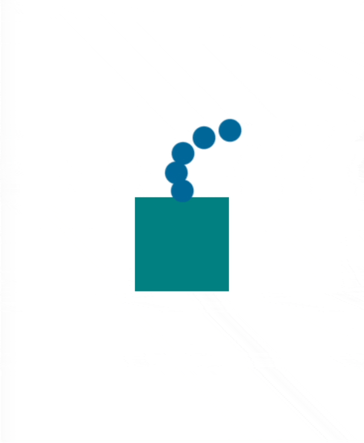

<h1 align="center">react-native-caemitterlayer</h1>

<p align="center">
A React Native wrapper for iOS's <a target="_blank" href="https://developer.apple.com/documentation/quartzcore/caemitterlayer">CAEmitterLayer</a></p>

<p align="center">Create powerful and performant particle effects for your React Native apps!
</p>

<p align="center">
   
</p>

## 💿 Installation

Add this package to your app with the following command:

```bash
npx expo install react-native-caemitterlayer
```

> ⚠️ This module is built on [Expo Modules API](https://docs.expo.dev/modules/overview/) and thus requires Expo 47 or above.
> If your project is a "vanilla" React Native application, consider [adding Expo to it](https://docs.expo.dev/bare/installing-expo-modules/) to utilize the Expo ecosystem.

> ℹ️ If not already, you will have to adopt [Expo prebuild](https://docs.expo.dev/workflow/prebuild/) or [Expo dev builds](https://docs.expo.dev/develop/development-builds/introduction/) to make use of custom native modules.

## 🔥 Basic Usage

`EmitterView` requires an `emitterConfig` prop which configures the underlying `CAEmitterLayer` and `CAEmitterCell`s to be emitted.


<table>
<tr>
   <th align="center">Basic example</th>
   <th align="center">Result</th>
</tr>
<tr>
<td width="50%">

```tsx
import { View } from 'react-native'
import { EmitterConfigPropType, EmitterView } from 'react-native-caemitterlayer'

const circleBase64 = '...' // omitted for brevity, see Basic example: example/examples/Basic.tsx

export function BasicExample() {
  const emitterConfig: EmitterConfigPropType = {
    layer: {
      // center the emission point in the middle of top edge of the view
      emitterPosition: {
        x: 50,
        y: 0,
      },
      emitterCells: [
        {
          imageData: circleBase64, // base64 encoded PNG image
          color: '#006699',
          lifetime: 5, // particles live for 5 seconds
          velocity: 20,
          birthRate: 1, // One particle per second
          emissionLongitude: -Math.PI / 2, // emit particles up
          emissionRange: Math.PI / 4, // emit particles in a 45 degree cone
        },
      ],
    },
  }

  return (
    <View
      style={{
        width: '100%',
        height: '100%',
        justifyContent: 'center',
        alignItems: 'center',
      }}>
      <EmitterView
        emitterConfig={emitterConfig}
        style={{ width: 100, height: 100, backgroundColor: 'teal' }}
      />
    </View>
  )
}
```

</td>
<td width="50%">
The code above produces this result:

<p align="center">
   
</p>
</td>
</tr>
</table>

Check out the [example app](example/) for more in depth and powerful examples.

## 📖 Documentation

### `EmitterView`

```tsx
import { EmitterView } from 'react-native-caemitterlayer';

<EmitterView
   emitterConfig={...}
/>
```

**Props**

#### `emitterConfig: EmitterConfigPropType` (required)

The `CAEmitterLayer` configuration for this `EmitterView`. See below for how to configure this prop, or check out the example app's [examples](example/examples/) for working examples.

#### `emitterConfig.layer: EmitterLayer` (required)

Configures the single `CAEmitterLayer` which will render particles.

#### `emitterConfig.layer.enabled?: boolean`

Whether or not the emitter is enabled. Defaults to `true`.

#### `emitterConfig.layer.initialValues?: object`

Values which are applied to the `CAEmitterLayer` on mount and whenever the layer transitions from `enabled: false` -> `enabled: true`.
This is useful for setting certain [`CAMediaTiming` properties](https://developer.apple.com/documentation/quartzcore/camediatiming) which should only be set once (e.g. `beginTime`).

#### `emitterConfig.layer.emitterCells?: EmitterCellType[]`

An array of `EmitterCellType` objects which act as templates for the particles emitted by the layer.
Each property on the `EmitterCellType` is optional and has the same defaults as the corresponding property on `CAEmitterCell`. See the [CAEmitterCell docs](https://developer.apple.com/documentation/quartzcore/caemittercell) for details on each property.

#### `emitterConfig.layer` - `CAEmitterLayer` properties

The rest of the properties on `emitterConfig.layer` are passed directly to the `CAEmitterLayer` instance (if set) and have the same defaults they would on `CAEmitterLayer`. See the [CAEmitterLayer docs](https://developer.apple.com/documentation/quartzcore/caemitterlayer) for details on each property.

#### `...ViewProps`

`EmitterView` also accepts all the same `ViewProps` props (i.e. `style`) as a [React Native `View`](https://reactnative.dev/docs/view).

## 🗺️ Roadmap

Future plans for features/enhancements/fixes (in no particular order/priority):

- **Better image support**

  This library currently requires inlining of the images used for emitter cells (via `EmitterCellType.imageData`). The images must be represented as base64 encoded strings on the JS side. This isn't ideal for performance or developer ergonomics. A better way of handling images is high priority.

- **Better animation support**

  It's currently not possible to animate `EmitterView` directly via RN Animated or Reanmiated. Will be looking at ways to support this to avoid having to wrap the `<EmitterView>` in an `<Animated.View>` or similar.

- **Support placeholders for `emitterPosition` and `emitterSize`.**

  `emitterPosition` and `emitterSize` require specifying exact coordinates/sizes. For some uses, `useWindowDimensions` may be sufficient. However, due to the nature of how React Native renders things, you may have to wait until `onLayout` is called before knowing what to set these values to. Adding placeholder values/strings could reduce the need for `onLayout`/`useWindowDimensions` as we could then set `emitterSize`/`emitterPosition` on the native side.

- Support emoji as emitter cell contents.
- Support drawing basic images to be used in emitter cells (circle, oval, rect, triangle, etc)
- Possible animation support of layer or cell properties - either via Animated/Reanimated or basic `CAAnimation`s

### Not planned/Out of scope

#### Android support

Android support is not planned at this time. Android does not contain a built in particle emitter engine. I've explored various options but there's drawbacks to each. I've also investigated building one myself. However, it would take much effort reach parity with `CAEmitterLayer`.

## 🙌 Acknowledgements

A number of blog posts helped immensely with learning `CAEmitterLayer`. These authors also provided great examples which were used to test this library's functionality:

- https://nshipster.com/caemitterlayer/ by [@Mattt](https://github.com/mattt)
- https://bryce.co/caemitterbehavior/ by [@brycepauken](https://github.com/brycepauken)
- https://bryce.co/recreating-imessage-confetti/ by [@brycepauken](https://github.com/brycepauken)
- https://medium.com/@peteliev/what-do-you-know-about-caemitterlayer-368378d45c2e by [@peteliev](https://github.com/peteliev)

## ⚖️ License

MIT
